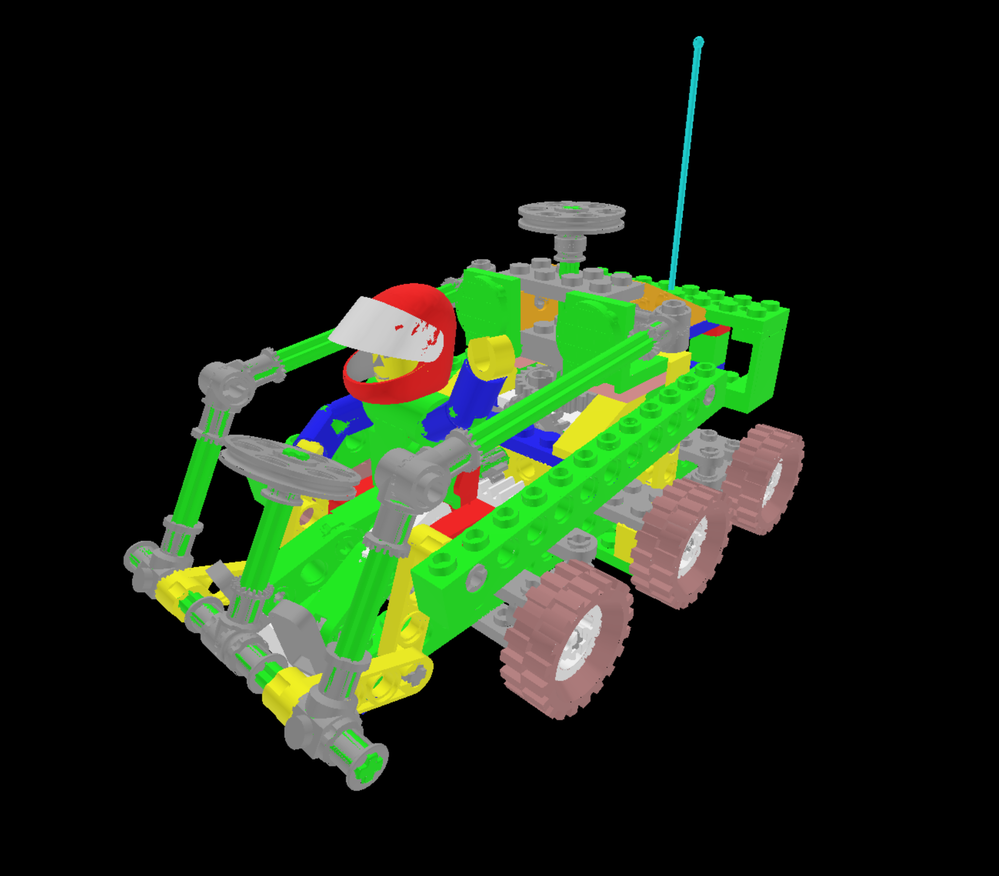

<div id="top"></div>
<!-- PROJECT LOGO -->
<br />
<div align="center">
    

  <h1 align="center">glTF PBR Renderer - WebGPU</h1>
  <h2 align="center">Zixin Zhang</h2>
  <h3 align="center">zixinzha@seas.upenn.edu</h3>
</div>

<!-- ABOUT THE PROJECT -->

## About The Project

> glTF is not "yet another file format."

There are more than 70 different file formats for 3D data. Why do we need one more? What I like about glTF is that it can significantly simplify the [3D content pipeline](https://github.com/KhronosGroup/glTF-Tutorials/blob/master/gltfTutorial/images/contentPipelineWithGltf.png). Instead of implementing hundreds of importers and converters for various file formats, runtime applications only need to support glTF that is provided by custom converters such as obj2gltf.

WebGPU is an unreleased Javascript Graphics API with its own shading language called WGSL. However, this project uses GLSL as the shading language. [@webgpu/glslang](https://www.npmjs.com/package/@webgpu/glslang) converts GLSL to SPIR-V so that it can be used on WebGPU.

This projects uses [glTF-Transform](https://github.com/donmccurdy/glTF-Transform), a glTF 2.0 SDK for TypeScript, to load glTF files from the web. With this SDK, we can easily query the data inside glTF without implementing the glTF loading structure from scratch.

## Supported glTF Features

✅: fully supported

❗: partially supported (loading time is long)

### Loading 

- Loading glTF adn glb files (supported by `gl-Transform`) ✅

### Core

- Core glTF 2.0 Sample Models

| Antique Camera✅ | Avocado✅ | Barramundi Fish✅ |
|---|---|---|
||||

| Boom Box✅ | Corset✅ | Damaged Helmet✅ |
|---|---|---|
||||

| Flight Helmet✅ | Lantern✅ | Sci Fi Helmet✅ |
|---|---|---|
||||

|  Suzanne✅ | Water Bottle✅ | 
|---|---|
|||


### Standard

- Standard glTF 2.0 Sample Models 
  - Box ✅
  - Box Interleaved✅
  - Box Textured✅
  - Box Textured NPOT✅
  - Box With Spaces✅
  - Box Vertex Colors✅
  - Cube✅
  - Duck✅
  - 2 Cylinder Engine ❗
  - Reciprocating Saw ❗
  - Gearbox Assy ❗
  - Buggy ❗
  - Sponza❗
  - Two Sided Plane✅

### Feature Tests

- Feature Tests glTF 2.0 Sample Models 
  - Boom Box With Axes ✅
  - TextureSettingsTest ✅

## Implementation Details

The simplified structure of the project can be summarized using the following graph:

<div align="center">
    
<h8 align="center">Figure 1: Simplified Structure</h8>
</div>

Only a single set of vertex and fragment shader is used. The functionality of the shaders are determined by `#define` preprocessor. These `#define`s are dynamically generated and inserted into the shaders. This is very similar to the shader architecture used in [glTF-Sample-Viewer](https://github.com/KhronosGroup/glTF-Sample-Viewer) by KhronosGroup. In fact, the shaders are obtained directly from [glTF-Sample-Viewer](https://github.com/KhronosGroupglTF-Sample-Viewer), but they cannot be used directly in the WebGPU pipelines. All uniforms need to be put in the uniform block and assigned a layout and binding, and all samplers are replaced by pairs of `texture` and `sampler`. All that is left is to pass these data to the shaders in WebGPU's way.

<!-- GETTING STARTED -->

## Getting Started

To test out this project: 

1. Clone the repo
2. Install NPM packages and Use Chrome Canary to open a localhost 
   ```sh
   npm i
   ```

<p align="right">(<a href="#top">back to top</a>)</p>

<!-- USAGE EXAMPLES -->

## Things that didn't go well

- My original intention to use GLSL is that I can study and reuse most of the shader codes in [glTF-Sample-Viewer](https://github.com/KhronosGroup/glTF-Sample-Viewer). However, adding an extra layer of conversion means that models with lots of primitives/meshes are loaded very slowly since the renderer creates and converts shaders per primitive. This is one of the disadvantages of using GLSL as the shading language.
- Most of the rendering codes are squeezed into a single file. Also, there are some obvious opportunities for refactoring due to my initial unfamiliarity with WebGPU. My future plan is to make the renderer more object-oriented for readability and refactor some repeating code to following [DRY](https://en.wikipedia.org/wiki/Don%27t_repeat_yourself) principle. 

<p align="right">(<a href="#top">back to top</a>)</p>

<!-- ROADMAP -->

## Roadmap

- [ ] Improve loading time of large models
- [ ] Support more models from feature test
- [ ] Support Animation and Skin
- [ ] Support materials extensions such as transmission
- [ ] Support for user camera
- [ ] Make renderer more object-oriented and refactor repeating codes

<p align="right">(<a href="#top">back to top</a>)</p>


<!-- ACKNOWLEDGMENTS -->

## Acknowledgments

Thank you for all the authors below for making this project possible. 

- [Practical WebGPU Graphics by Jack Xu, PhD](https://drxudotnet.com/Home/DownloadCode?bookId=20) for introducing me to the world of WebGPU and providing the base code for this project. 
- [KhronosGroup/glTF-Sample-Viewer](https://github.com/KhronosGroup/glTF-Sample-Viewer) for providing a wonderful place to study glTF renderer. Importantly, the shader source codes are derived from this project. 
- [glTF-Transform by Don McCurdy](https://gltf-transform.donmccurdy.com/) for providing an easy-to-use SDK for loading and reading glTF files. 
- [kainino0x/glslang](https://github.com/kainino0x/glslang.js) for providing a way to use GLSL shaders in WebGPU.
- [The Complete JavaScript Course 2022: From Zero to Expert! by Jonas Schmedtmann](https://www.udemy.com/course/the-complete-javascript-course/) for teaching me what "async/await" means and the fundamental of Javascript. Highly recommend this course! 
- [Understanding TypeScript - 2022 Edition by Maximilian Schwarzmüller](https://www.udemy.com/course/understanding-typescript/) for teaching me those finer details about Typescript. 

<p align="right">(<a href="#top">back to top</a>)</p>

## Epilogue

- If you use Webpack as the module bundler, remember to use development mode. Otherwise, class and variable names will not be properly displayed (i, S instead of class name, breakpoints not hit all the time)
- Need at least #version 310 es to use glslang
- Existing shaders in Khronos are NOT compatible with WebGPU. To make it work, we need to add layout and non-opaque uniforms.
- The Map object holds key-value pairs and remembers the original insertion order of the keys.
- `Number of entries (3) did not match the number of entries (1) specified in [BindGroupLayout]` If we declare uniform in the shader, we need to use them in the main() function. 
